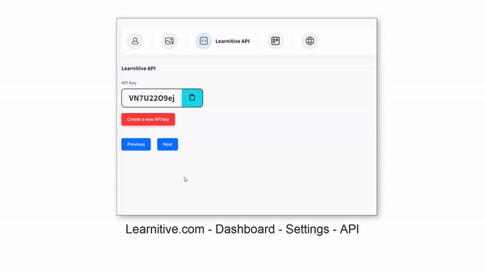
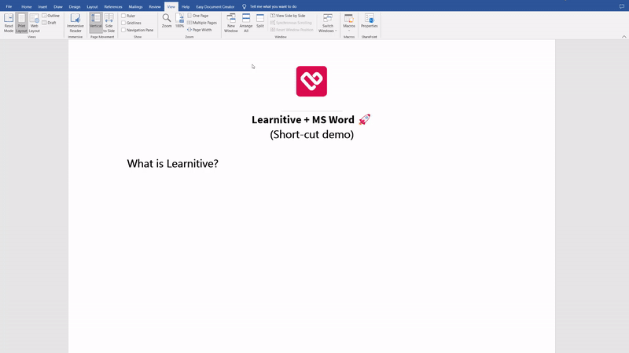

<div align="center">
  <a href="https://www.learnitive.com/">
    
  </a>

  <br />
  <h3 align="center">Learnitive + MS Word 🚀</h3>

  <p align="center">
    Enhance your writing experience with Learnitive + MSWord, a Microsoft Office macro that brings Learnitive AI directly into Word.
    <br />
    <a href="https://www.learnitive.com/ai-api"><strong>Explore the Learnitive API »</strong></a>
    <br />
    <br />
      <a href="https://www.youtube.com/watch?v=h50Z3oMRJlI" target="_blank;">
    
  </a>
    <br />
    <br />
    <a href="https://github.com/learnitive/MSWord/issues">Report Bug</a>
    ·
    <a href="https://github.com/learnitive/MSWord/issues">Request Feature</a>
  </p>


</div>


## Install 

This is a simple Microsoft Word Macro allowing you to use AI prompts within Word through the Learnitive API. These instructions may only apply to recent versions of Microsoft Windows. 

1. Open **Microsoft Word** `>` **View** `>` **Macros** (or `Alt-F8`).
2. Enter a name (should be **"Learnitive"** or you will need to change the macro code).
3. The editor will open up, replace everything with the code in the `macro.vba` file.
4. Replace `YOUR-KEY-HERE` with your own Learnitive API key. Get your key from the [https://www.learnitive.com/ai-api](https://www.learnitive.com/ai-api)
5. Enter the `input prompt` (**select text**) you want to send to the **Learnitive API** .
6. Run the `Learnitive` subroutine by pressing `Alt-F8` and clicking **Run**. 
7. Response from the Learnitive API will be inserted into the document where the cursor was last placed.

## Languages

Please replace the `line 66` of the `macro.vba` as follows:

```
lang = "fr"
requestPayload = "{""input"":""" & content & """, ""model"":""" & model & """,
""lang"":""" & lang & """ , ""max_tokens"":""" & max_tokens & """,
""temperature"":""" & temperature & """ }"
```
Supported language codes: https://help.learnitive.com/article/suppoted-languages/

## Shortcut: `CTRL + L`

Use the following steps to create a shortcut for the Learnitive macro created above. These instructions may only apply to recent versions of Microsoft Windows. 

1. Click **File** > **Options** > **Customize Ribbon**.
2. Under **Keyboard shortcuts**, click **customise** and  **Macros** > **Learnitive**.
3. Press ``CTRL + L`` and **assign** and then close.
4. Write and **select a text** and press ``CTRL + L``, AI content will appear shortly.

<div align="center">

  <p align="center">
<br />
    <br />
      <a href="https://www.youtube.com/watch?v=_6qdi4vQX4k" target="_blank;">
    
  </a>
    <br />
    <br />
    </p>


</div>


## Disclaimer
The authors and contributors of this program provide it as-is, without any warranties or guarantees. They cannot be held responsible for any damages resulting from the use of this program.

## License
This program is licensed under the MIT license.

## Original Author
Johann Dowa

## Modification
Updated by: Learnitive
